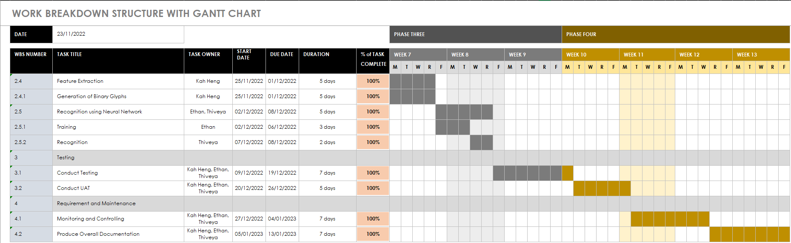
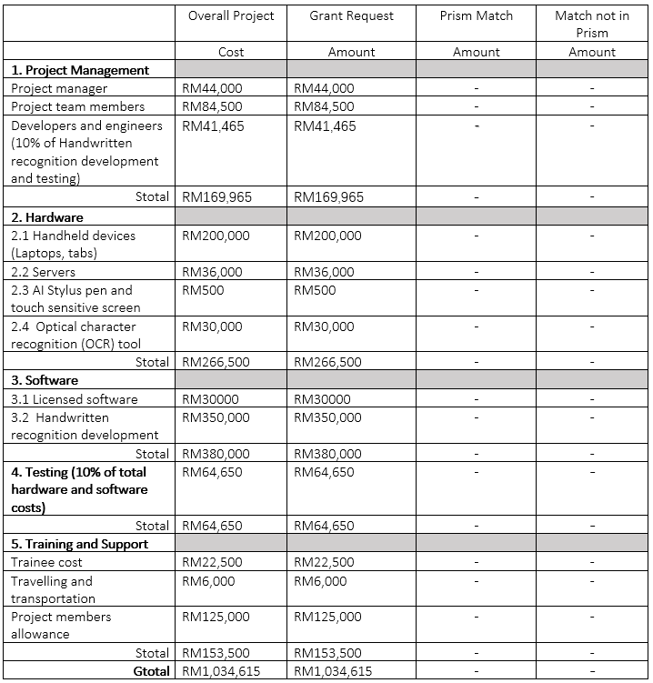

# PROJECT OVERVIEW

## E. COMPLETING THE PROJECT
### Closing Checklist

#### 1. Customer Acceptance Form

#### 2. Lessons Learned Document

#### 3. Final Project Report
**HANDWRITTEN RECOGNITION SYSTEM**

**1.0 PROJECT OBJECTIVES**

The car plate recognition system done by QTMT Inc. was intended to develop an artificial intelligence system that are able to detect Malaysia car number plate. Besides, one of the aims of QTMT Inc. is to develop a system that are able to recognize the character of the car number plate. Not only that, we also intend to build an application programming interface (API) for the future ease if use as the integration module.

**2.0 SUMMARY OF PROJECT RESULTS**

After the system has been completed, we tested the accuracy of the system. The system is 30%

**3.0 ORIGINAL AND ACTUAL SCHEDULE**

The project member sticks to the Gantt chart scheduled so, the actual progress fits the original schedule.

**4.0 ORIGINAL AND ACTUAL BUDGET**

The actual budget matches the original budget, which means that the team has followed the budget planned at the beginning of the project and does not use any excessive money.

**5.0 PROJECT ASSESSMENT**

**5.1 SCOPE**

The project scope was initiated from the beginning of the project. For instance, the system is not able to detect the handwriting if the handwriting is too blurry and messy. If the image of hanwdriting reflective, and with special fonts also cannot run for the recognition. The system also scopes down the limit of the project by only detect alphabet and number character. Therefore, this system may not be used by countries like China or Thailand, which includes Thai and Mandarin.

**5.2 OBJECTIVES**

The main objective is to recognize online handwritten documents, which includes characters, words, lines, paragraphs etc. A system that is artificial intelligence powered, which uses deep-learning technique has been made. Deep learning is used in this project to identify the image and read the characters od the handwriting. 

**5.3 IMPACTS**

By creating this system, it can be use for the historical preservation. Historical papers mostly exists has physical format. Examples of historical papers are genealogical information, written manuscripts, old family records, and some personal diaries and sometimes even shared old past stories. It helps to transform the writings in the papers to a text document format which can also be said as readable electronic format. By this way, historical facts can be stored, reviewed and shared easily to many people.From the perspective of teachers and professors, this system can help them identify the fonts of different students, making it easier for them to mark the test papers

**6.0 TRANSITION PLAN**

#### 4. Close Contract

   
##### Next: [Project Presentation](F-PROJECT_PRESENTATION.md)

